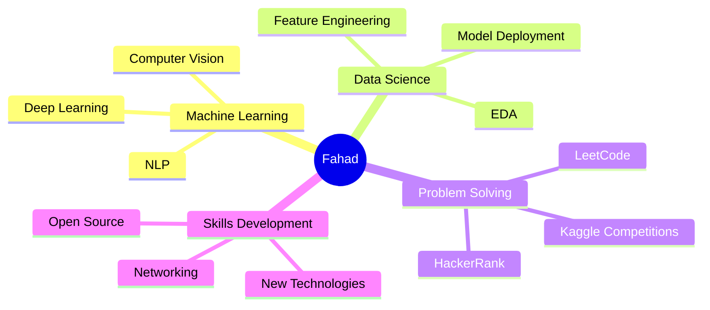

<div align="center">

<!-- Animated Header -->


</div>

<div align="center">
  
  <!-- Typing Animation -->
  <a href="https://git.io/typing-svg">
    
  </a>

  <!-- Profile Views Counter with Animation -->
  <p>
    
    
  </p>

</div>

---

## 🚀 About Me


```python
class MachineLearningEngineer:
    def __init__(self):
        self.name = "Md. Fahad Hasan"
        self.role = "ML Engineer"
        self.location = "Dhaka, Bangladesh"
        self.interests = ["AI", "Data Science", "Problem Solving"]
        
    def say_hi(self):
        print("Thanks for dropping by! Let's build something amazing together.")

me = MachineLearningEngineer()
me.say_hi()
```

- 🔭 Currently working on **Machine Learning Projects**
- 🌱 Learning **Advanced Deep Learning & NLP**
- 💡 Love solving problems through **code & algorithms**
- 🎯 Goal: **Contribute to impactful AI solutions**
- ⚡ Fun fact: **Code is poetry, algorithms are art**

---

## 🌐 Connect With Me

<div align="center">

[](https://mdfahadhasan.netlify.app/)
[](https://www.linkedin.com/in/md-fahad-hasan-61720a350)
[](https://github.com/fahadhasan93)
[](https://www.kaggle.com/fahadhasan93)
[](https://leetcode.com/u/mdfahadhasan/)
[](https://www.hackerrank.com/profile/mdfahadhasan627)
[](https://www.facebook.com/profile.php?id=100027571990918)
[](https://www.instagram.com/fahad_hasan_mithu/)
[](mailto:mdfahadhasan627@gmail.com)

</div>

---

## 💻 Tech Stack

<div align="center">

### 🎨 Frontend


### 🐍 Programming Languages


### 📊 Data Science & ML


### 🗄️ Database


### 🛠️ Tools


</div>

---

## 📊 GitHub Statistics

<div align="center">
  
  <!-- GitHub Stats Card -->
  
  
  <!-- GitHub Streak Stats -->
  

</div>

<div align="center">
  
  <!-- Top Languages -->
  
  
  <!-- Activity Graph -->
  

</div>

---

## 🏆 GitHub Trophies

<div align="center">
  
  

</div>

---

## 🐍 Contribution Snake

<div align="center">
  
  <picture>
    <source media="(prefers-color-scheme: dark)" srcset="https://raw.githubusercontent.com/fahadhasan93/fahadhasan93/output/github-contribution-grid-snake-dark.svg">
    <source media="(prefers-color-scheme: light)" srcset="https://raw.githubusercontent.com/fahadhasan93/fahadhasan93/output/github-contribution-grid-snake.svg">
    
  </picture>

</div>

---

## 💭 Random Dev Quote

<div align="center">
  
  

</div>

---

## 🎯 Current Focus

<div align="center">



</div>

---

<div align="center">

### 💬 Quote of the Day
*"The only way to do great work is to love what you do."* - Steve Jobs

---

### 👀 Visitor Hook

 <em><b>I love connecting with fellow developers and AI enthusiasts!</b></em>

⭐ **Feel free to explore my repositories and connect if you share similar interests in AI/ML!**

<details>
<summary>🎯 <b>What I'm Looking For</b></summary>
<br>
  
- 🤝 **Collaboration** on Machine Learning projects
- 💡 **Discussions** about AI, Data Science, and algorithms
- 🌟 **Feedback** on my work and projects
- 🚀 **Opportunities** to learn and grow together
- 📫 **Networking** with like-minded individuals

</details>

---

### ⚡ Let's Build Something Amazing Together!


**Made with ❤️ and lots of ☕**

</div>
